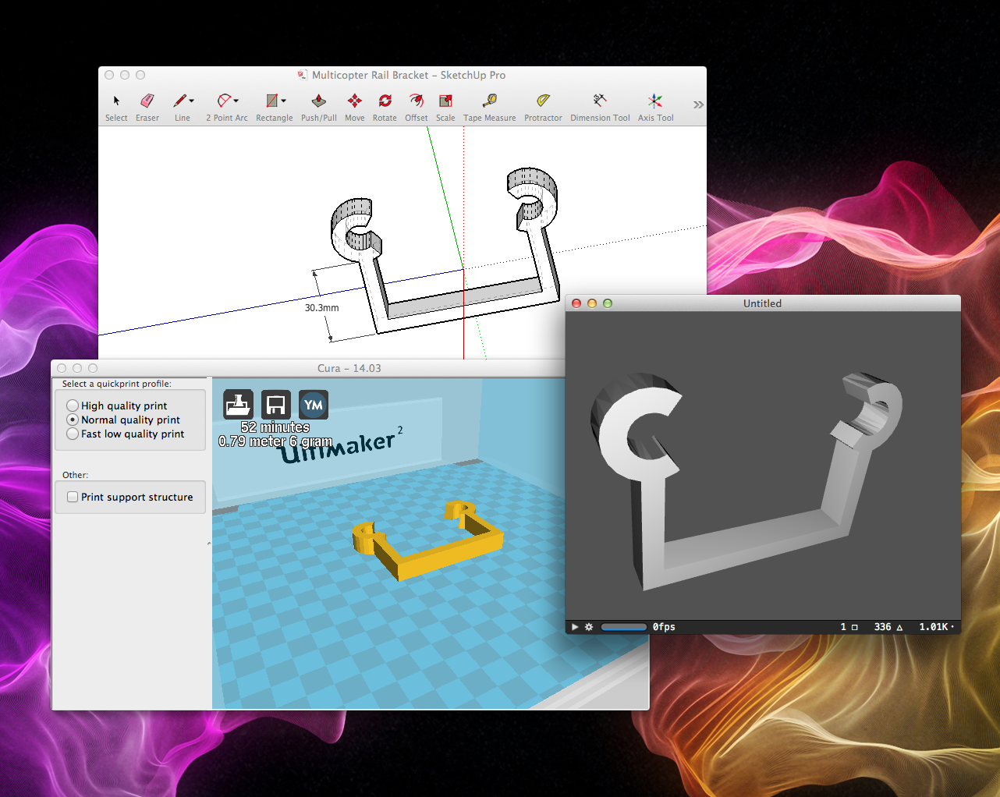

# Scenekit-STL-Importer

A SceneKit importer for [STL files][1]. STL files are commonly used in 3D-printing.

[1]: http://en.wikipedia.org/wiki/STL_(file_format)

The following sample image shows an STL in [SketchUp][2], in [Cura][3] and in SceneKit - imported via this project:

[2]: http://www.sketchup.com
[3]: http://wiki.ultimaker.com/Cura

## Current State

Importing binary and text files works ok. The text import makes one SCNNode per triangle(!) which is obviously super inefficient but most STL files are binary anyway. I do intend on making a QuickView plugin for STL files but might end up using WebGL (and THREE.js) instead.
